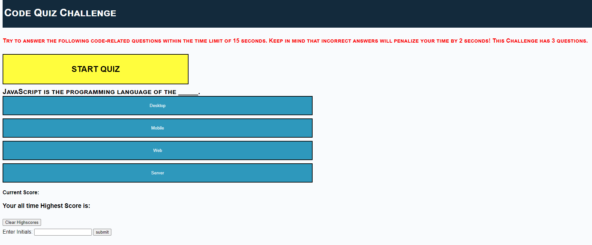

# **Code Quiz Challenge**
## Webpage for the code quiz challenge

### **Project Description:**
This website generates 3 multiple choice questions so that students can test
their knowledge on JavaScript fundamentals. Student high scores are stored in
the local storage of the browser.

### **Technolgies & Acceptance Criteria:**
This website uses these technologies to work properly:
- [HTML] - HyperText Markup Language.
- [CSS] - Cascading Style Sheets used as the style sheet language.
- [JS] - Advanced Javascript Language.

This website was coded using the the Acceptance Criteria mentioned below:
- When I click the start button, then a 15 second countdown timer starts and I am presented with a question.
- When I answer a question, then I am presented with the next question.
- When I answer a question incorrectly, then 2 seconds is subtracted from the countdown clock.
- When all the questions are answered or the timer reaches 0, then the code quiz is over.
- When the code quiz is over, then I can save my initials and score.
- This website keeps track of the high scores and clears them on request by the student.

### **Deployed website link:**
https://rakibca.github.io/code-quiz/

### **Credits:**
- [W3Schools](https://www.w3schools.com "W3Schools")
- [MDN Web Docs](https://developer.mozilla.org "MDN Web Docs")
- [Google](https://www.google.com "Google's Homepage")
- Tutor: BCS Oscar Zapata